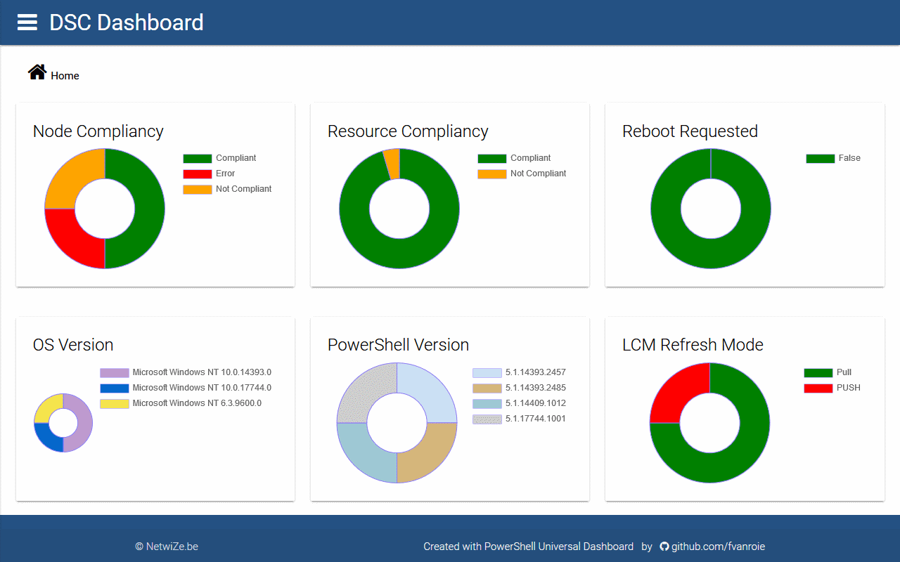
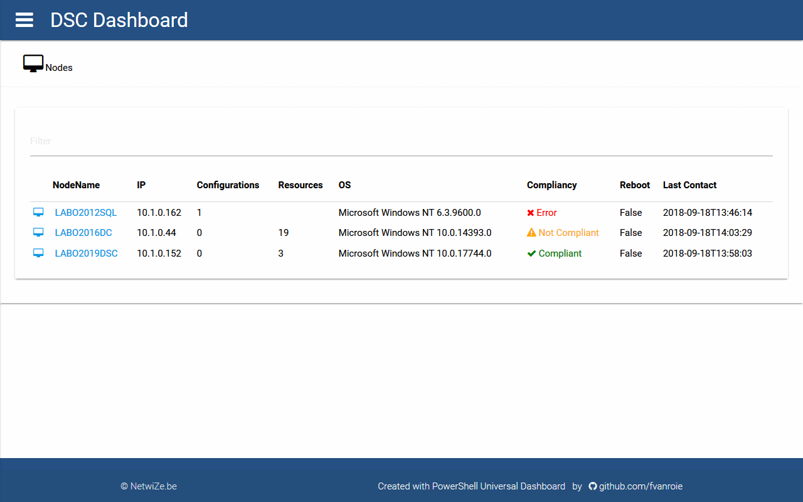

# DscDashboard


## Description

This is a PowerShell module and a dashboard that can connect to a DSC Pull Server database. The GUI displays
statistics and allows you to view the Status Reports generated by your LCM clients. It is a web interface
that uses the data from the DSC Pull Server framework and makes it easily available to browse.

The website can be hosted on the DSC Pull Server or as a separate server.
A Dockerfile is also available to quickly test the DscDashboard functionality.


## Prerequisites

### DSC Pull Service with
- Windows Server 2016 Core Semi-Annual Channel release 1803   *or*
- Windows Server 2019 Insider Preview
- SQL Server backend

You need to have a DSC Pull Service from WMF 5.1 that is
[configured to use a SQL Server](https://blogs.technet.microsoft.com/askpfeplat/2018/07/09/configuring-a-powershell-dsc-web-pull-server-to-use-sql-database/)
backend. The integrated MDB or ESENT databases are not supported by this module.

__Note:__
> SQL Server support will not be added to previous versions of WMF 5.1 (or earlier) and
> will only be available on Windows Server versions **greater than or equal to 17090**.

This means you need to have at least Windows 2016 SAC 1803 or Windows 2019 Insider Preview.

### Universal Dashboard Module

The dashboard is created using the [Universal Dashboard](https://ironmansoftware.com/universal-dashboard) module for PowerShell.
You need to have this module installed on the server hosting the dashboard. You can use either the
[Community](https://www.powershellgallery.com/packages/UniversalDashboard.Community/) or the
[Full edition](https://www.powershellgallery.com/packages/UniversalDashboard/), depending on your usage and license requirement.


## Optional

### IIS with websockets enabled

The Universal Dashboard can run directly from PowerShell but it is recommended to host the site in IIS. The DSCService already has a dependancy on IIS.
Also, Websockets needs to be installed and enabled in IIS for the dashboard to work properly.

Alternatively there is a Docker container that has all the components installed to connect to a SQL Server hosting the DSC database.

## Synopsis

A PowerShell Module to


## Installation on Windows

### Install IIS and Websockets

```powershell
PS> Install-WindowsFeature "Web-Server","Web-WebSockets"

Display Name                                            Name                       Install State
------------                                            ----                       -------------
[X] Web Server (IIS)                                    Web-Server                     Installed
            [X] WebSocket Protocol                      Web-WebSockets                 Installed
```


### Install .Net Core Hosting Bundle

Universal Dashboard needs the .Net Core Hosting package to 
[run in IIS](https://adamdriscoll.gitbooks.io/powershell-universal-dashboard/content/running-dashboards/iis.html):
- [.NET Core 2.1 Runtime & Hosting Bundle for Windows (v2.1.4)](https://www.microsoft.com/net/download/dotnet-core/2.1)

__Important:__
> Install the dotnet-hosting-2.1.4-win.exe package after you have installed IIS, otherwise some paths
> will get overwritten by the IIS installation and you need to re-install the .Net Core Hosting package.

Reboot the server to make the changes to the environment variables active.


### Install the modules

Install the DscDashboard and UniversalDashboard modules in the folder C:\Program Files\WindowsPowershell\Modules:

```powershell
PS> Get-Module -Name "*Dashboard*" -ListAvailable

    Directory: C:\Program Files\WindowsPowerShell\Modules

ModuleType Version    Name                                ExportedCommands
---------- -------    ----                                ----------------
Script     0.0.1      DscDashboard                        {New-DscDashboardCustomHeader...}
Script     2.0.1      UniversalDashboard.Community        {New-UDChart, New-UDDashboard...}
```

They need to be accessible by the dashboard.ps1 script that runs in IIS.


### Copy files to wwwroot

We will use the IIS Default Website location to host the dashboard instead of the default placeholder website.
You can use another directory if the Default Website is already used to host a site.

Copy:
- The entire contents of C:\Program Files\WindowsPowershell\Modules\UniversalDashboard
    to C:\initpub\wwwroot\
- The file dashboard.ps1 from C:\Program Files\WindowsPowershell\Modules\DscDashboard\
    to C:\initpub\wwwroot\


## How to use

Open a browser on the server and browse to http://localhost to test the dashboard:




## Notes

```yaml
   Name: DscDashboard
   Created by: fvanroie, NetwiZe.be
   Created Date: September 15 2018
```